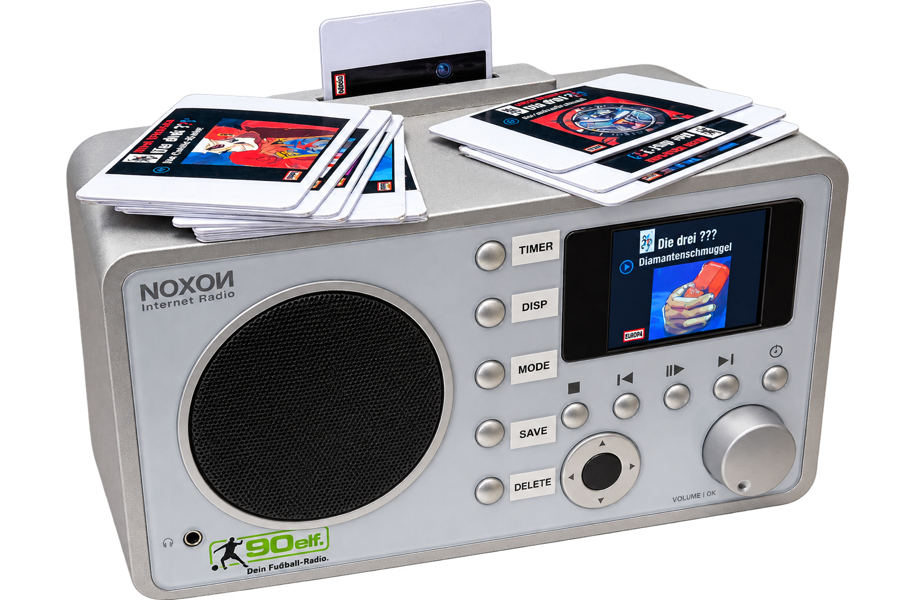
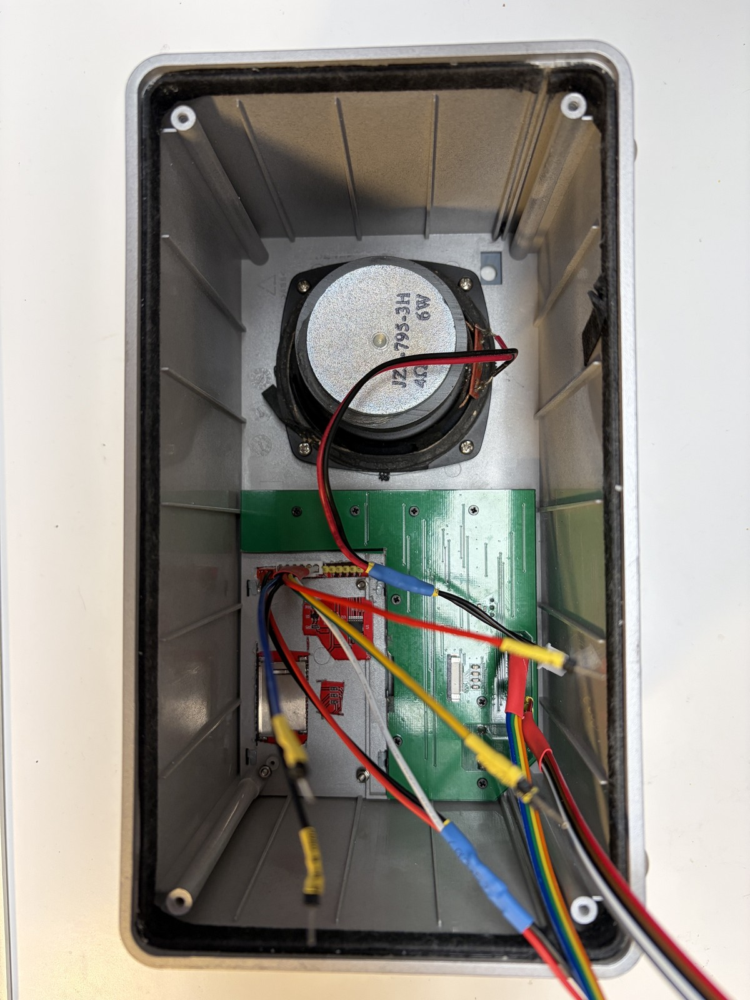
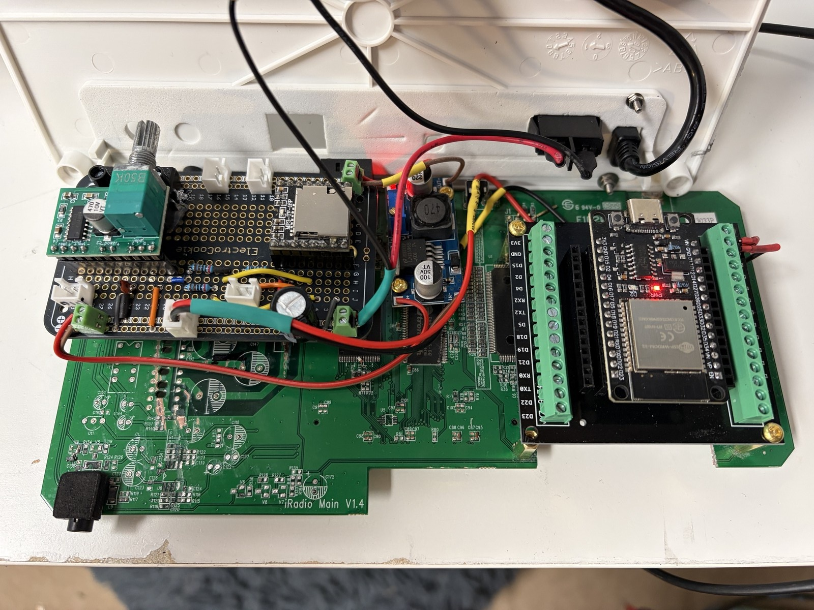

# Höribert 2.0

<p align="center">
  
</p>

Höribert 2.0 ist ein eigenständiger, ESP32-basierter Hörspiel- und Audioplayer in der Hardware und mit dem Bedienkonzept eines NOXON-Geräts. Diese Geräte wurden vom Hersteller teilweise gebrickt und erhalten so ein neues Leben. Wiederverwenet wird das Frontpanel und der Lautsprecher. Das orginale Display wurde gegen ein Farbdisplay ersetzt, das zufällig genau reinpasst. Die originale Platine des Noxon wurde als "Träger" für den ESP32 Aufbau mit dem Beakout Board verwendet.

RFID-Karten wählen Hörspielordner aus, ein DFPlayer Mini übernimmt die Audiowiedergabe und ein ILI9341-TFT zeigt Statusinformationen oder Coverbilder an. Die vorhandene NOXON-Tastenplatine und der analoge Lautstärkeregler werden weiterverwendet.

> **Projektstatus:** Dieses Projekt ist abgeschlossen und wird derzeit nicht aktiv gepflegt. Es wird ohne Anspruch auf Support oder zukünftige Weiterentwicklung bereitgestellt.

## Funktionen

- Wiedergabe nummerierter DFPlayer-Ordner über RFID-Karten
- TonUINO-kompatibles RFID-Kartenformat
- Album-Modus mit automatischer Wiedergabe aufeinanderfolgender Tracks
- Play/Pause, Stop, nächster und vorheriger Track
- manuell speicherbare Bookmarks pro RFID-UID
- automatisches Bookmark beim Ablauf des Sleep-Timers
- Sleep-Timer in Zehn-Minuten-Schritten
- TFT-Statusanzeige
- Coverbilder aus LittleFS
- analoge Lautstärkeregelung
- separater Hardware-Testmodus
- Diagnose für Tasten, IR, RFID, Display, DFPlayer und OTA
- Unterdrückung unmittelbar doppelter DFPlayer-Finish-Meldungen

Im Normalbetrieb wird derzeit ausschließlich der TonUINO-kompatible **Kartenmodus 2 (Album)** abgespielt. Andere auf RFID-Karten gespeicherte Modi werden erkannt, aber nicht ausgeführt.

---

## Hardware

| Komponente | Aufgabe |
| --- | --- |
| ESP32 Dev Module | zentrale Steuerung |
| DFPlayer Mini | Audiowiedergabe von microSD |
| MFRC522 / RC522 | Lesen der RFID-Karten |
| ILI9341-TFT | Status- und Coveranzeige |
| 2 × 74HC165 | Einlesen der NOXON-Fronttasten |
| analoges Potentiometer | Lautstärkeregelung |
| IR-Empfänger | Diagnose im Hardware-Testmodus |

---

## Pinbelegung

| Funktion | ESP32-Pin |
| --- | --- |
| 74HC165 DATA | GPIO19 |
| 74HC165 CLOCK | GPIO18 |
| 74HC165 LOAD | GPIO5 |
| IR-Empfänger | GPIO27 |
| Lautstärkepotentiometer | GPIO34 |
| DFPlayer RX | GPIO16 |
| DFPlayer TX | GPIO17 |
| RFID SS/CS | GPIO21 |
| RFID RST | GPIO22 |
| RFID SCK | GPIO14 |
| RFID MISO | GPIO23 |
| RFID MOSI | GPIO13 |
| TFT CS | GPIO25 |
| TFT DC | GPIO26 |
| TFT RST | GPIO33 |
| TFT Backlight | GPIO32 |
| TFT MOSI | GPIO13 |
| TFT SCK | GPIO14 |

TFT und RFID teilen sich MOSI und SCK. Beide Geräte besitzen einen eigenen Chip-Select-Anschluss.

Beim DFPlayer bezeichnet `RX` den Empfangspin des ESP32 und `TX` den Sendepin des ESP32:

```text
DFPlayer TX  → ESP32 RX
DFPlayer RX  ← ESP32 TX
```

Für die konkrete Verdrahtung ist zusätzlich die Dokumentation des jeweils verwendeten DFPlayer-Moduls zu beachten.

---

## NOXON-Tastenplatine und 74HC165-Schieberegister

Auf der NOXON-Tastenplatine sitzen zwei kaskadierte **74HC165 Parallel-in/Serial-out-Schieberegister**.

Zusammen stellen sie 16 parallele Eingänge bereit, obwohl der ESP32 dafür nur drei Signalleitungen benötigt:

- `DATA` an GPIO19 transportiert die Bits seriell zum ESP32.
- `CLOCK` an GPIO18 schiebt jeweils das nächste Bit heraus.
- `LOAD` an GPIO5 übernimmt gleichzeitig den aktuellen Zustand aller parallelen Eingänge.

```text
NOXON-Tasten
    │
    ▼
┌─────────┐    ┌─────────┐
│ 74HC165 │───▶│ 74HC165 │─── DATA ──▶ GPIO19
└─────────┘    └─────────┘
     ▲              ▲
     └──── CLOCK ───┴──────── GPIO18
     └──── LOAD ───────────── GPIO5
```

`ButtonBoard::readRaw()` zieht `LOAD` kurz auf LOW und anschließend wieder auf HIGH. Danach erzeugt die Funktion 16 Clock-Impulse.

Vor jedem Impuls wird der aktuelle DATA-Pegel gelesen. Der bisherige Wert wird um eine Stelle verschoben und das neue Bit eingefügt. Dadurch entsteht ein vollständiger `uint16_t`-Tastenstatus.

`ButtonBoard::update()` vergleicht diesen Status mit dem vorherigen Zustand.

Der Ausdruck

```cpp
currentState & ~lastState
```

enthält nur die Bits, die aktuell gesetzt sind, im vorherigen Durchlauf aber noch nicht gesetzt waren.

Dadurch reagiert die Bedienlogik auf **neu gedrückte Tasten** und nicht in jedem Programmdurchlauf erneut auf eine gehaltene Taste.

Eine separate zeitbasierte Entprellung besitzt der aktuelle Code nicht.

### Tastenbelegung der Schieberegister

Von den 16 möglichen Eingängen sind 14 den internen Projektbezeichnungen A bis N zugeordnet.

Die physische NOXON-Beschriftung ist im aktuellen Projekt nicht eindeutig den Bits zugeordnet; deshalb verwendet die Dokumentation bewusst die internen Bezeichnungen.

| Interne Taste | Bit | Maske |
| --- | ---: | ---: |
| A | 9 | `0x0200` |
| B | 8 | `0x0100` |
| C | 3 | `0x0008` |
| D | 2 | `0x0004` |
| E | 1 | `0x0002` |
| F | 4 | `0x0010` |
| G | 10 | `0x0400` |
| H | 5 | `0x0020` |
| I | 7 | `0x0080` |
| J | 6 | `0x0040` |
| K | 14 | `0x4000` |
| L | 13 | `0x2000` |
| M | 12 | `0x1000` |
| N | 15 | `0x8000` |

Bit 0 und Bit 11 sind derzeit keiner Taste zugeordnet.

---

## Bedienung

Die Software verwendet die intern ermittelten Tastenbezeichnungen A bis N.

### Normalbetrieb

| Taste | Funktion |
| --- | --- |
| A | Sleep-Timer um 10 Minuten verlängern; Doppeldruck löscht ihn |
| B | Display ein-/ausschalten |
| C | Cover- und Textanzeige umschalten |
| D | aktuelle Position als Bookmark speichern |
| E | Bookmark der aktiven Karte löschen |
| F | Stop |
| G | vorheriger Track |
| H | Play/Pause |
| I | nächster Track |

### Hardware-Testmodus

Für den Hardware-Testmodus muss **Taste J bereits beim Einschalten beziehungsweise Reset gedrückt gehalten werden**.

Im Testmodus gelten unter anderem folgende Tasten:

| Taste | Funktion |
| --- | --- |
| F | Stop |
| G | vorheriger Track |
| H | Play/Pause |
| I | nächster Track |
| J | DFPlayer-Status anzeigen |
| L | nächster Ordner |
| N | vorheriger Ordner |

Zusätzlich protokolliert der Testmodus:

- erkannte Tasten
- IR-Daten
- Lautstärke
- RFID-Daten
- DFPlayer-Ereignisse

Die Ausgabe erfolgt über TFT und serielle Schnittstelle.

**WLAN und OTA sind ausschließlich im Hardware-Testmodus aktiv.**

---

## RFID

Unterstützt werden:

- MIFARE Classic
- MIFARE Ultralight / NTAG

Höribert liest ein zum ursprünglichen TonUINO kompatibles Kartenformat.

Im Normalbetrieb startet eine gültige Karte mit **Modus 2 (Album)** den auf der Karte gespeicherten Ordner.

### RFID-Kartenformat

Höribert verwendet das Kartenformat des ursprünglichen TonUINO-Projekts als kompatibles Format.

Auf der Karte werden unter anderem folgende Werte gespeichert beziehungsweise gelesen:

| Feld | Bedeutung |
| --- | --- |
| Magic Cookie | `13 37 B3 47` |
| Version | Version des Kartenformats |
| `folder` | Ordnernummer |
| `mode` | Wiedergabemodus |
| `special` | zusätzlicher Modusparameter |
| `special2` | zusätzlicher Modusparameter |

Bei MIFARE-Classic-Karten befinden sich diese Daten im **Datenblock 4 des ersten verwendeten Sektors**.

Dadurch können bereits entsprechend beschriebene TonUINO-Karten weiterhin verwendet werden.

Das Kartenformat und die ursprüngliche Implementierung gehen auf das historische **TonUINO-Projekt von Thorsten Voß** zurück:

https://github.com/tonuino/TonUINO

Das heutige Community-Projekt wird hier weiterentwickelt:

https://github.com/tonuino/TonUINO-TNG

Die aktuelle Höribert-Firmware besitzt eine eigene RFID- und Anwendungslogik und übernimmt lediglich die Kompatibilität zum Kartenformat.

### Bookmarks

Bookmarks werden lokal im **NVS des ESP32** gespeichert und anhand der RFID-Karten-UID zugeordnet.

Gespeichert werden:

- Ordner
- Track
- vom ESP32 geschätzte Laufzeit

Beim Fortsetzen startet die aktuelle Implementierung den gespeicherten Track **von dessen Anfang**. Es findet kein Zeitsprung zu einer bestimmten Position innerhalb der MP3-Datei statt.

Ein Bookmark wird erzeugt:

- manuell über Taste D
- automatisch beim Ablauf des Sleep-Timers

Nach dem natürlichen Ende eines Ordners wird das zugehörige Bookmark gelöscht.

### Hinweis zum RC522-Modul

Im Höribert wurde erfolgreich ein blaues RC522-Modul mit der Platinenkennzeichnung

**HW-126**

eingesetzt.

RC522-Module existieren in verschiedenen Platinenvarianten und werden teilweise auch mit unterschiedlichen kompatiblen Chips angeboten.

Obwohl die Module äußerlich nahezu identisch aussehen können, unterscheiden sie sich in der Praxis teilweise deutlich bei:

- Lesereichweite
- Zuverlässigkeit
- Antennenabstimmung
- RF-Matching
- verwendetem RFID-Chip

Insbesondere die Antennen- und Matching-Beschaltung der Platine kann einen erheblichen Einfluss darauf haben, ob RFID-Karten zuverlässig erkannt werden.

Falls Karten trotz korrekter Verkabelung und Software nicht zuverlässig oder nur aus sehr kurzer Entfernung erkannt werden, sollte testweise ein anderes RC522-Modul verwendet werden.

Die im Projekt erfolgreich getestete Platinenvariante trägt die Kennzeichnung:

**HW-126**

Die Kennzeichnung allein garantiert jedoch weder einen originalen NXP MFRC522 noch eine bestimmte Chiprevision.

---

## SD-Karte des DFPlayers

Die Audiodateien liegen auf der **microSD-Karte des DFPlayers**.

Dieses Dateisystem ist vollständig unabhängig vom LittleFS-Dateisystem des ESP32, in dem die Coverbilder gespeichert werden.

### Verzeichnisstruktur

Die Wiedergabe verwendet den DFPlayer-Befehl:

```cpp
playFolder(folder, track)
```

Die Verzeichnisse und Dateien sollten daher folgendermaßen aufgebaut sein:

```text
/01/
├── 001.mp3
├── 002.mp3
├── 003.mp3
└── ...

/02/
├── 001.mp3
├── 002.mp3
└── ...

/03/
└── 001.mp3
```

Dabei gelten folgende Regeln:

- Ordner werden numerisch von `01` bis `99` benannt.
- Tracks werden innerhalb eines Ordners dreistellig benannt.
- Die Nummerierung beginnt bei `001`.
- Die Nummerierung sollte lückenlos sein.
- Pro Ordner unterstützt der verwendete DFPlayer-Befehl höchstens 255 Tracks.

---

## Wichtig: Dateireihenfolge auf der DFPlayer-SD-Karte

Beim DFPlayer Mini reicht es nicht immer aus, dass die sichtbaren Dateinamen korrekt sortiert sind.

Neben den Dateinamen kann auch die **Reihenfolge der Verzeichniseinträge im FAT-Dateisystem** eine Rolle spielen.

Dadurch kann beispielsweise eine Datei

```text
002.mp3
```

intern vor

```text
001.mp3
```

eingeordnet sein, obwohl die Dateinamen im Dateimanager korrekt aussehen.

Mögliche Folgen sind:

- falsche Track-Reihenfolge
- falsche Zuordnung von Tracknummern
- unerwartete Sprünge
- scheinbar übersprungene Dateien

Deshalb sollte die SD-Karte möglichst sauber vorbereitet werden.

### Empfohlene Struktur

```text
/01/001.mp3
/01/002.mp3
/01/003.mp3
...
/02/001.mp3
/02/002.mp3
/02/003.mp3
...
```

### Windows

Unter Windows gibt es standardmäßig kein direktes Werkzeug wie `fatsort`, mit dem sich die Reihenfolge der FAT-Verzeichniseinträge nachträglich zuverlässig sortieren lässt.

Für eine neue Karte empfiehlt sich daher:

1. microSD-Karte als FAT32 formatieren.
2. Ordner und MP3-Dateien zunächst auf dem PC vollständig vorbereiten.
3. Ordner als `01`, `02`, `03` usw. benennen.
4. Tracks als `001.mp3`, `002.mp3`, `003.mp3` usw. benennen.
5. Den kompletten Inhalt anschließend möglichst in einem Durchgang auf die leere SD-Karte kopieren.

Wenn die Wiedergabereihenfolge trotzdem nicht stimmt, ist eine Kontrolle beziehungsweise Sortierung der FAT-Einträge unter Linux die zuverlässigere Variante.

### Linux

Unter Linux kann die FAT-Verzeichnisreihenfolge mit `fatsort` sortiert werden.

Zuerst unbedingt feststellen, welches Gerät die SD-Karte ist:

```bash
lsblk -o NAME,SIZE,FSTYPE,MOUNTPOINTS,MODEL
```

> **Achtung:** Die folgenden Gerätenamen sind nur Beispiele.  
> Vor jedem Befehl unbedingt prüfen, welches Gerät tatsächlich die SD-Karte ist.

Angenommen, die Partition der SD-Karte lautet:

```text
/dev/sdX1
```

Zunächst aushängen:

```bash
sudo umount /dev/sdX1
```

Optional kann das FAT-Dateisystem vorher geprüft werden:

```bash
sudo fsck.vfat -n /dev/sdX1
```

Anschließend die FAT-Verzeichniseinträge sortieren:

```bash
sudo fatsort -n /dev/sdX1
```

Danach die Karte wieder einhängen oder sicher entfernen.

Beispielsweise:

```bash
udisksctl power-off -b /dev/sdX
```

### Versteckte Dateien vermeiden

Auf der DFPlayer-SD-Karte sollten möglichst nur die benötigten Ordner und Audiodateien liegen.

Zusätzliche vom Betriebssystem erzeugte Dateien können problematisch sein, beispielsweise:

```text
.DS_Store
._001.mp3
.Trashes
Thumbs.db
desktop.ini
```

Wenn Tracks trotz korrekt benannter Dateien in falscher Reihenfolge abgespielt werden, sollte daher neben den Dateinamen auch die FAT-Verzeichnisreihenfolge geprüft werden.

---

## Display und Coverbilder

Coverbilder werden im **LittleFS-Dateisystem des ESP32** gespeichert.

Sie liegen **nicht auf der microSD-Karte des DFPlayers**.

Die Coverbilder selbst sind aus urheberrechtlichen Gründen nicht Bestandteil dieses Repositorys.

Lokale JPG-Dateien unter `data/` werden über `.gitignore` vom Commit ausgeschlossen.

### Cover ablegen

Eigene beziehungsweise lokal vorhandene Cover werden im Projektverzeichnis unter

```text
data/
```

abgelegt.

Beispiel:

```text
Hoeribert-2.0/
├── data/
│   ├── 1.jpg
│   ├── 2.jpg
│   ├── 3.jpg
│   └── ...
├── src/
├── include/
└── platformio.ini
```

Die Zahl im Dateinamen entspricht der Ordnernummer des Hörspiels.

Für Ordner 1 sucht die Firmware beispielsweise zunächst nach:

```text
/1.jpg
```

und anschließend nach:

```text
/01.jpg
```

Daher funktionieren beispielsweise:

```text
data/1.jpg
```

oder:

```text
data/01.jpg
```

Für Ordner 23 entsprechend:

```text
data/23.jpg
```

Fehlt ein Coverbild, verwendet Höribert automatisch die textbasierte Anzeige.

### Empfehlungen für Coverbilder

- JPEG/JPG verwenden
- keine unnötig hohe Auflösung verwenden
- Dateigröße möglichst klein halten
- nur Bilder verwenden, für die entsprechende Nutzungsrechte bestehen

### Cover auf den ESP32 übertragen

Höribert per USB mit dem Rechner verbinden und im Projektverzeichnis ausführen:

```bash
pio run -e esp32dev_usb -t uploadfs
```

PlatformIO erstellt dabei aus dem Inhalt des Verzeichnisses `data/` ein LittleFS-Dateisystem und überträgt dieses in die entsprechende Flash-Partition des ESP32.

### Firmware und LittleFS sind getrennt

Ein normaler Firmware-Upload:

```bash
pio run -e esp32dev_usb -t upload
```

überträgt **nur das Programm**.

Ein LittleFS-Upload:

```bash
pio run -e esp32dev_usb -t uploadfs
```

überträgt die Dateien aus `data/`.

Daraus ergibt sich:

```text
Code geändert        → Firmware-Upload
Cover geändert       → LittleFS-Upload
Code + Cover geändert → beide Uploads
```

Ein Firmware-Update überschreibt die bereits vorhandenen Cover normalerweise nicht, solange die Flash-Partitionierung beziehungsweise das Dateisystem nicht geändert oder formatiert wird.

---

## Installation und Build

Benötigt werden:

- Visual Studio Code mit PlatformIO

oder

- eine lokale PlatformIO-CLI

Repository klonen:

```bash
git clone https://github.com/toor0001/Hoeribert-2.0.git
cd Hoeribert-2.0
```

Lokale Konfigurationsdatei anlegen:

```bash
cp include/secrets.example.h include/secrets.h
```

Anschließend die lokalen WLAN-Daten in

```text
include/secrets.h
```

eintragen.

Diese Datei ist über `.gitignore` ausgeschlossen und darf nicht committed werden.

### Build

```bash
pio run -e esp32dev_usb
```

### Firmware per USB hochladen

```bash
pio run -e esp32dev_usb -t upload
```

### Cover / LittleFS per USB hochladen

```bash
pio run -e esp32dev_usb -t uploadfs
```

---

## WLAN und OTA

WLAN und OTA sind ausschließlich im **Hardware-Testmodus** aktiv.

Für OTA:

1. Taste J gedrückt halten.
2. Höribert einschalten oder zurücksetzen.
3. Auf erfolgreiche WLAN-Verbindung und IP-Ausgabe warten.
4. OTA-Upload starten.

Über den Hostnamen `noxon`:

```bash
pio run -e esp32dev -t upload
```

Falls mDNS im lokalen Netzwerk nicht funktioniert, kann die IP-Adresse explizit angegeben werden:

```bash
pio run -e esp32dev -t upload --upload-port <IP-ADRESSE>
```

Im Normalbetrieb wird WLAN bewusst abgeschaltet. Ein normal gestarteter Höribert ist daher nicht per OTA erreichbar.

---

## Projektstruktur

```text
src/          Firmware und Hardware-Abstraktionen
include/      lokale Konfiguration und Vorlagen
data/         lokale LittleFS-Coverbilder
docs/         Projektdokumentation und Bilder
test/         PlatformIO-Tests, sofern künftig ergänzt
```

Die Coverbilder unter `data/` sowie lokale Zugangsdaten sind nicht Bestandteil des öffentlichen Repositorys.

---

## Credits / Herkunft

Höribert 2.0 ist eine eigenständige ESP32-/NOXON-Implementierung.

Das kompatible RFID-Kartenformat und die grundlegende Idee der kartengesteuerten Ordnerwahl gehen auf das historische TonUINO-Projekt von **Thorsten Voß** zurück:

https://github.com/tonuino/TonUINO

Das heutige Community-Projekt wird als **TonUINO-TNG** weiterentwickelt:

https://github.com/tonuino/TonUINO-TNG

Die aktuelle Höribert-Firmware besitzt eine eigenständige ESP32-/NOXON-Architektur.

In der bereinigten, erreichbaren Git-Historie dieses Repositorys befindet sich kein direkt übernommener TonUINO-Quellcode.

Die über PlatformIO eingebundenen Bibliotheken, darunter unter anderem

- DFRobotDFPlayerMini
- MFRC522
- Adafruit GFX
- Adafruit ILI9341
- IRremote
- TJpg_Decoder

unterliegen jeweils ihren eigenen Lizenzen.

Lokal verwendete Coverbilder sind nicht Bestandteil dieses Projekts oder seiner Lizenz.

---

## Entwicklung

Bei Analyse, Refactoring, Fehlersuche und Dokumentation kamen **ChatGPT und OpenAI Codex** als KI-gestützte Entwicklungswerkzeuge zum Einsatz.

Konzept, Hardwareaufbau, Anforderungen, Integration und Tests am realen Gerät wurden durch den Projektbetreiber durchgeführt und überprüft.

---

## Lizenz

Der eigenständige Projektcode und die Projektdokumentationsfotos stehen unter der [MIT-Lizenz](LICENSE).

Lizenzen externer Bibliotheken und lokal verwendeter Medien bleiben davon unberührt.

---

## Einblicke ins Gerät

Auf dem rechten Bild sieht man, das ich die original NOXON Platine als Trägerplatte für den neuen Aufbau genutzt habe.

<p align="center">
  
  
</p>
